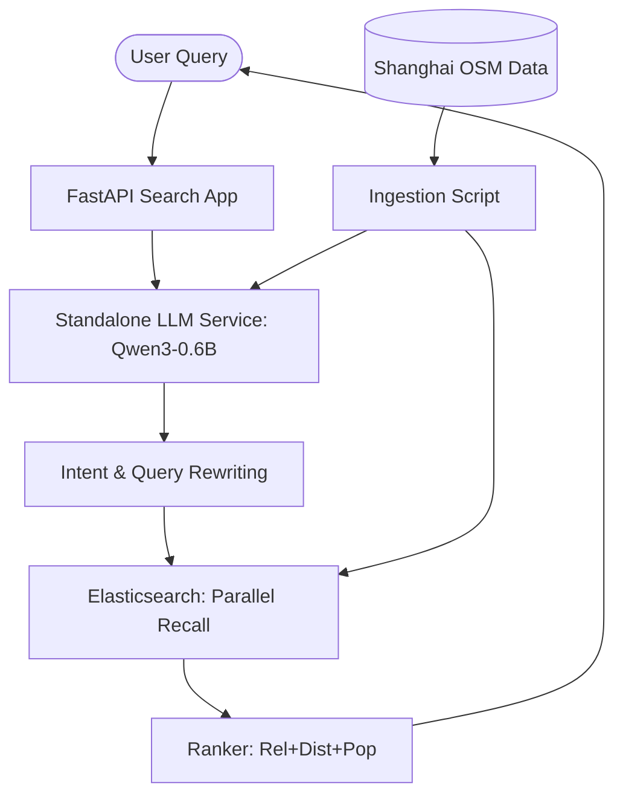

# Vibe Search: AI-Enhanced LBS Service 🔍📍

Vibe Search is a next-generation Location-Based Search (LBS) system designed for high semantic precision. It combines the power of a local **Qwen-0.6B LLM** with **Elasticsearch** to provide intent-aware search results for the Shanghai area.

## 🚀 Key Features

- **AI-Driven Semantic Enrichment**: Automatically generates keywords, phrases, and natural language descriptions for POIs during ingestion.
- **Strict Semantic Recall**: Implements `minimum_should_match: 2` across AI-generated semantic fields to eliminate low-relevance results.
- **Decoupled Architecture**: High-speed MLX-powered LLM service running as a standalone standalone API.
- **Multi-Factor Ranking**: Custom scoring balancing **Relevance**, **Gaussian Distance Decay**, and **Logarithmic Popularity**.
- **Unified Configuration**: Fully driven by a [`.env`](.env) file; from search radius to LLM temperature, everything is tunable without code changes.
- **One-Command Orchestration**: A robust [service manager](scripts/manage_services.sh) that handles Colima, Docker, LLM, and the App with one command.

---

## 🏗️ Architecture Overview



---

## 📂 Project Structure

- **`app/`**: Core application logic.
  - `nlp/`: Intent extraction and LLM client agents.
  - `recall/`: Advanced Elasticsearch query orchestration.
  - `ranking/`: Weighted scoring engine.
- **`data/`**: Large assets including OSM PBF files and LLM model weights.
- **`logs/`**: Centralized persistent logging and pipeline traces.
- **`scripts/`**: Service management and data ingestion utilities.
- **`tests/`**: Comprehensive test suite for LLM, ES, and full pipeline.

---

## 🚦 Quick Start

### 1. Unified Setup (Recommended)
You can start the entire stack (Docker, ES, LLM, and App) with a single command:
```bash
bash scripts/manage_services.sh start
```

### 2. Data Ingestion
Build the AI-enhanced index from Shanghai OSM data:
```bash
bash scripts/manage_services.sh ingest
```

### 3. Verification
Check the health and port status of all components:
```bash
bash scripts/manage_services.sh status
```

### 4. Search Trace
Review the detailed execution flow of a search in the logs:
```bash
tail -f logs/pipeline_trace.log
```

---

## 🔧 Configuration Tuning

The system is fully tunable via the [`.env`](.env) file. Key parameters include:

| Parameter | Description | Default |
| :--- | :--- | :--- |
| `LLM_MODEL_PATH` | Local MLX model location | `data/models/Qwen3...` |
| `DEFAULT_RADIUS_KM` | Search radius for recall | `5.0` |
| `WEIGHT_REL` | Gravity of textual relevance | `0.5` |
| `RANK_DIST_SIGMA` | Gaussian decay sigma for distance | `2.0` |
| `INGEST_LIMIT` | Max POIs to process for AI enrichment | `5000` |

---

## 🛠️ Management Commands

| Command | Action |
| :--- | :--- |
| `start` | Sequential startup with health checks |
| `stop` | Graceful shutdown of all services & Colima |
| `ingest` | Automated AI-enhanced data ingestion |
| `clean_logs` | Clear application and trace logs safely |
| `cleanup` | **Reset** (Deletes ES data and logs) |

---

## 📜 Development History

The project evolved through five key phases:
1.  **Infrastructure Initialization**: Docker/ES environment setup with Shanghai OSM integration.
2.  **Core Pipeline Build**: Implementation of NLP (MLX), Recall, and Ranking modules.
3.  **Semantic Enrichment**: AI-driven metadata generation during ingestion using local Qwen.
4.  **Service Decoupling**: Separation of the LLM into a standalone high-performance API.
5.  **Unified Orchestration**: Implementation of the `.env` configuration and management framework.
